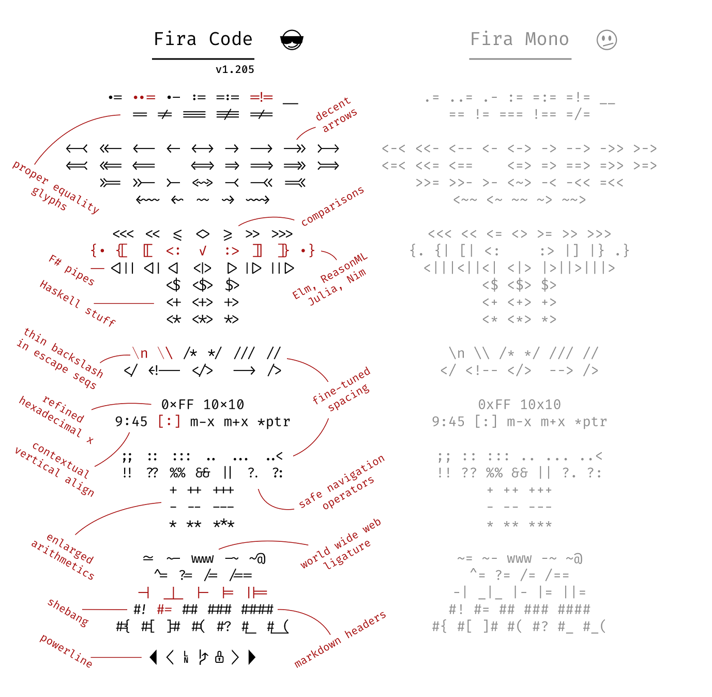
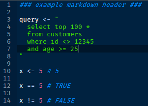
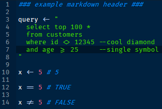
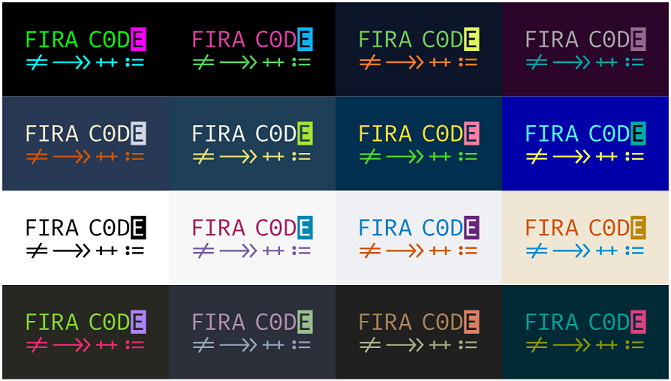
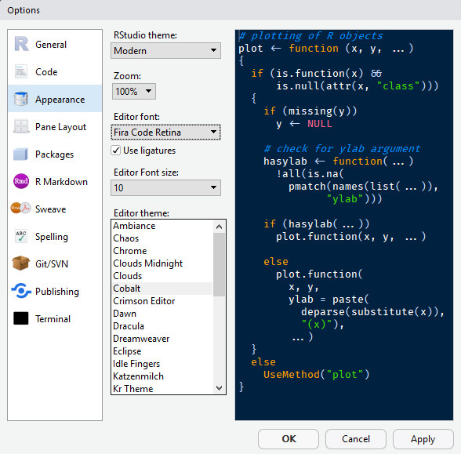
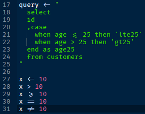
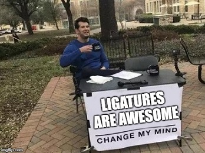
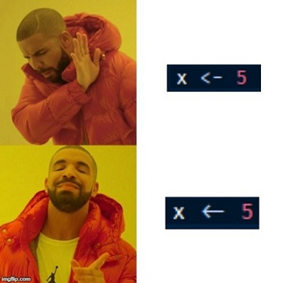

```{r setup, include=FALSE}
knitr::opts_chunk$set(echo = FALSE)
```

# Introduction

* Pizza Scientist with data problems @dominos

* Franchise Development
  + where to build new stores?
  + how well those new stores will do?

* Supply Chain
  + what/how many items should stores order for the next 8 weeks?
  + how to help distribution centers anticipate those orders?

* Deploying ML into production
  + navigating complex eCommerce platform
  + containerized microservices
---

# What is Fira Code?

* monospaced font with programming ligatures
* ligatures are Unicode symbols for certain operators
* Fira Code is a great font even without ligatures!

.center[]
---

# Why use ligatures?

* interpret multiple characters into a single symbol (or glyph)
* save a little space
* fonts have advanced enough to address this

.center[ ]
---

# Why use ligatures?

## **tl;dr** they make code look pretty

.center[]
---

# Enabling ligatures in RStudio

* Tools --> Global Options --> Appearance

.center[]
---

# What I don't like about ligatures

* Unicode characters don't line up well with other single characters
  + is it still monospace?
* hard to distinguish similar glyphs
* known issues with certain Unix systems
  + https://github.com/tonsky/FiraCode/issues/4
  + solved with `sudo apt install fonts-firacode`

.center[]
---

# Lots of other tools can use ligatures

* JetBrains
* Atom
* BBEdit/TextWrangler
* Notepad++
* SublimeText
* Spyder

.center[ ]
---

# Links

* https://github.com/tonsky/FiraCode
* https://medium.com/larsenwork-andreas-larsen/ligatures-coding-fonts-5375ab47ef8e
* https://www.danclarke.com/fira-code
* https://www.hanselman.com/blog/MonospacedProgrammingFontsWithLigatures.aspx

